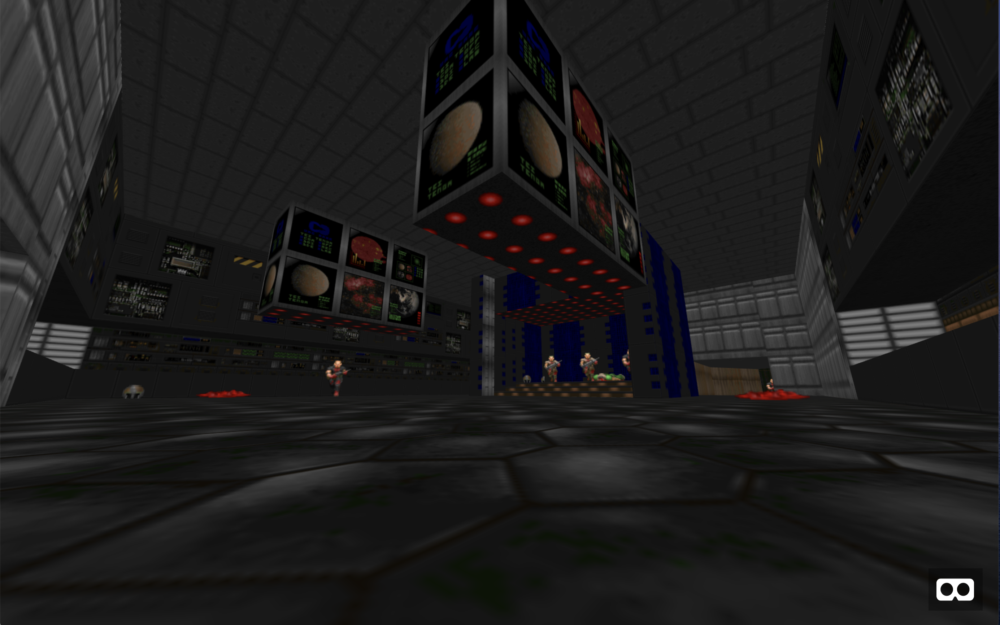

Doom WebVR
==========

A personal project consisting of algorithms, mathematics, revisiting childhood memories, cutting edge browser API's and virtual reality.

For more information on this project, please read 
[this blog post](https://ianbelcher.me/tech-blog/building-a-webvr-version-of-doom)

The current version can be accessed at https://doom-webvr.ianbelcher.me.

Development
-----------

Due to the nature of the build process, there is currently no development tool to watch for 
changes. You must run the build every time you want changes to take effect.

To run the build simply run 
`npm run build`

To serve the current build, you can run the serve script such as
`npm run serve`

This will make the current build available on http://localhost:8080
